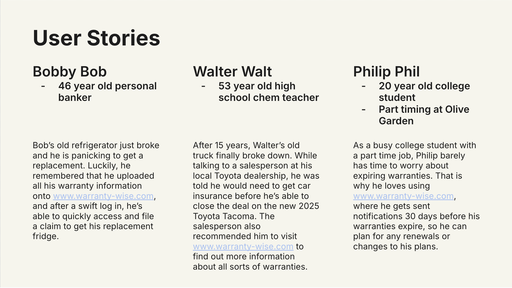
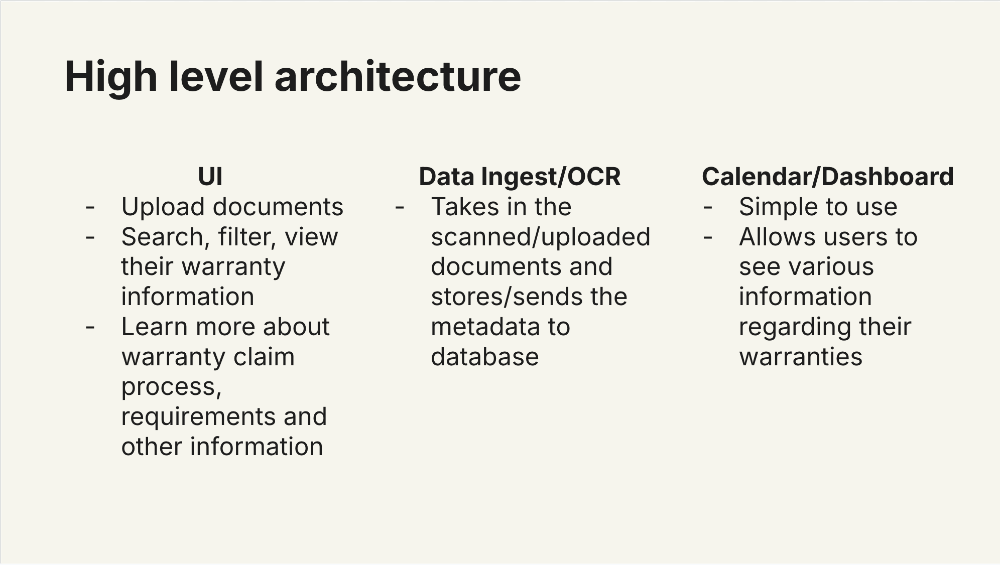
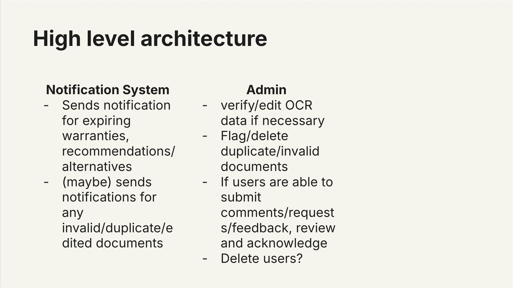
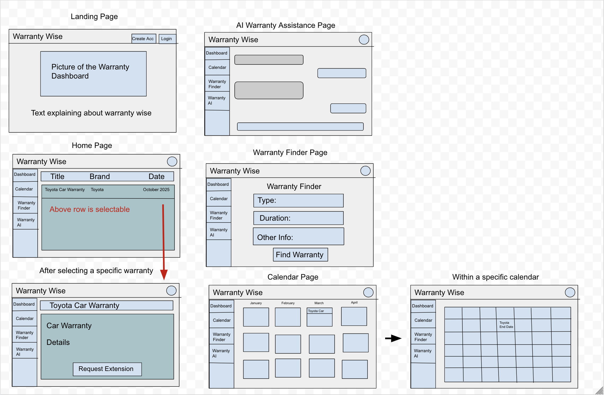

## Overview 
Warranty-Wise is a web application focused on providing users with a centralized platform where they can search, filter and view their product and service warranties. Users are also able to browse and explore our built in information hub, where they can find answers to questions pertaining to the warranty claim process along with its requirements, warranty acquisition process and requirements, warranty extension options and more. By using Warranty-Wise, users can stay organized with all of their warranties and be automatically reminded when certain ones are about to expire, and be offered extension options based on their needs. 

## Weekly Development History

### January 20th
During the initial week of development, after meeting with the project sponsor, we focused on solidifying the overall vision of the project, along with establishing some initial user stories reflecting the different features outlined in the vision and how users would utilize them. Because we had time, we also started researching potential tech stacks that could be utilized for this project. 

### January 27th
After reviewing the user stories from last week, we knew that we needed to make some changes and add more detail to the overall process that the user goes through while both navigating our site, as well as utilizing the feature. We also got started on creating initial mockups of the main pages of the application, as well as the high-level architecture and creating the GitHub organization and repositories that will hold the home page as well as the code base. 

### February 3rd
After the weekly meeting, most of the mockups were approved, with a few needing changes based on general agreement from the entire group about how we want to implement certain features. The high-level architecture was also approved, but will continue to be a work-in-progress as we go through the development of the project, adding or removing any features as time goes on. The next steps include officially launching the Github home page and finalizing the tech stack and getting started on thinking about the specifics of the database. Figma and other similar tools were brought up during the meeting as something we could use to get some initial code using the mockups that were already created. 

