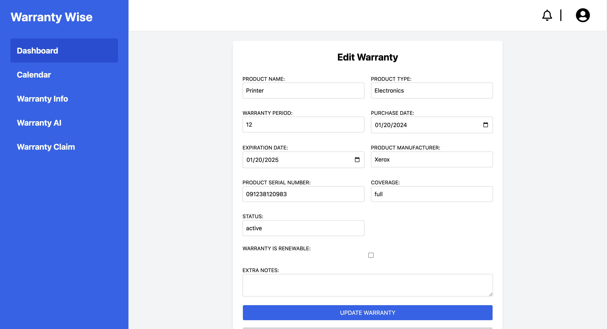

## Overview
Warranty-Wise is a web application focused on providing users with a centralized platform where they can search, filter and view their product and service warranties. Users are also able to browse and explore our built in information hub, where they can find answers to questions pertaining to the warranty claim process along with its requirements, warranty acquisition process and requirements, warranty extension options and more. By using Warranty-Wise, users can stay organized with all of their warranties and be automatically reminded when certain ones are about to expire, and be offered extension options based on their needs. 

## Weekly Development History

### January 20th
During the initial week of development, after meeting with the project sponsor, we focused on solidifying the overall vision of the project, along with establishing some initial user stories reflecting the different features outlined in the vision and how users would utilize them. Because we had time, we also started researching potential tech stacks that could be utilized for this project. 

### January 27th
After reviewing the user stories from last week, we knew that we needed to make some changes and add more detail to the overall process that the user goes through while both navigating our site, as well as utilizing the feature. We also got started on creating initial mockups of the main pages of the application, as well as the high-level architecture and creating the GitHub organization and repositories that will hold the home page as well as the code base. 

### February 3rd
After the weekly meeting, most of the mockups were approved, with a few needing changes based on general agreement from the entire group about how we want to implement certain features. The high-level architecture was also approved, but will continue to be a work-in-progress as we go through the development of the project, adding or removing any features as time goes on. The next steps include officially launching the Github home page and finalizing the tech stack and getting started on thinking about the specifics of the database. Figma and other similar tools were brought up during the meeting as something we could use to get some initial code using the mockups that were already created. 

### February 10th
During the weekly meeting, we looked at a barebones entity relationship diagram on potential tables and fields in the database. The consensus was that more research needs to be done regarding different types of warranties, claims, and documents and information needed for these processes. Extra research also needs to be done on potential extended warranties other services we can provide to users through the AI feature. On the front end, we continue to add more detail and flesh out the previous mockups and will soon start turning the designs into code through Figma and builder.io, and eventually start having the development environment configured. 

### February 17th
The revised ERD was showcased during the meeting and was met with great feedback. More work also went into implementing the homepage and getting an overall theme for the front-end. A basic login and signup page, along with a profile/account update page has been setup to test authentication, more styling can be done on these pages at a later date. For next week, we plan to continue working on our current task of focusing on a user story and getting those features and pages implemented. 

### February 24th
After the ERD was approved, the warranties table was setup on Supabase and populated with some initial data that can be used to render dummy data onto the site. A basic form for manually inserting warranties was created and verified to be inserting into the table after the form has been submitted. It was brought up during the meeting that we should note down that an automatic ingesting process would be preferred over manual forms, and this was something that can be accomplished through AI and OCR. This will be looked into further as more of the basic functionalities are fleshed out. 

More pages have been created following the theme of the homepage and more pages will continue to be worked on, especially regarding the information laid out in each page. For log-in and sign-ups, more authentication will be provided, such as using one's Google, Github, and Facebook accounts to log-in/sign-up. 

### March 3rd
For this week, we mainly focused on finishing up the core functionalities dealing with warranties, as well as styling the corresponding components related to each function. We have also moved towards rendering individual components instead of pages so that all actions allow the user to stay on the same page. As of this week, we have implemented, displaying the list of warranties the user owns, displaying more details about each warranty after their individual cards have been clicked, creating, editing, and deleting warranties. 

For the future, we plan on moving our focus towards more AI-related features, including mapping out the individual areas that we want to incorporate AI into the application, as well as researching different AI APIs or tech stacks that we can learn and utilize in the application. 

### March 10th
Due to midterms, most of the work that has been done are related to bug fixes that resulted from the previous weeks of development. These include fine tuning the login process and front-end responses from the back-end. The warranty insertion and edit forms were also edited to be more user-friendly with inputting certain fields. 

### March 17th
During this week, the basic functionalities of the OCR feature was implemented. When users click the insert warranty button, they're now given two choices, either to input the information manually through the default insertion form, or they can choose to upload their documents for the OCR to scan through. Currently that is the end of the cycle, however we want to incorporate an AI parser that will take the output from the OCR results, take all the useful information, and help users fill out the insertion form. When the form has been filled out in both cases, either manual or through AI/OCR, we will display a final form for the user to double check, making sure all the fields are filled out correctly before finally submitting. 

### March 31st
A simple AI chatbot has been implemented using OpenAI's API. Users are now able to navigate to the AI chatbot and ask questions about warranty information, claim process and other questions they might have with warranties. Most of the other work has been done in the database, where the midpoint table for warranty checking after AI parses the OCR plain text was made, as well as a notifications table. 

### April 7th
The AI parser has seen progress, it is now able to successfully parse the plain text provided by the OCR, the next stage is inserting into the midpoint table, and retrieving the appropriate row from that table, and displaying a confirmation form that users must go through and make sure every field is correct. Notifications has also been set up, but more refinement needs to be done to allow more options for user to delete/read notifications. Future plans also include a calendar system where events are added and displayed showing users the days they have warranties expiring, this acts as a better visual representation of the notifications system. 

### April 14th
The overall OCR flow has been implemented, at least conceptually. Users are now able to choose an image to upload to the OCR to scan through, and the AI will parse the text returned by the OCR into useful data that we can insert into a midpoint table. From there, we would fetch that entry from the table, and display it in a form for users to double check the information and do the final submission. We have also decided to go with using the calendar events system rather than the notifications, as that would require a constantly running process, which is not possible for local development. 

### April 21st
A calendar event table and UI has been created to showcase when an user's warranties would be expiring. Further improvements to the UI would need to be made, possibly a yearly view. The notifications system has been removed from the UI, but still kept in the code base as it is a future feature that would be implemented. We are also looking into adding a dedicated document view so users can view/delete any documents they have uploaded to the site. 

### April 28th
We have decided to do an overhaul of the sidebar, removing some options, but most importantly, moving the AI chatbot to be a forever showing feature on the bottom right of the screen. This way, our users would be able to access the chatbot at all times and ask questions. In the future, it would be nice to have it so that the chatbot can read the content on the screen that the user is on so it can give recommendations and better answers. A simple document view was created to list out all the documents the user has, but no other features have been implemented for it yet. 

### May 5th
View/download and delete feature has been added for the document view. However, we are looking into possibly moving the document view to the warranty details page, so it shows all the associated documents for each warranty, instead of just listing out all the documents. More UI standardization also needs to be made to freshen up and clean up the UI. 